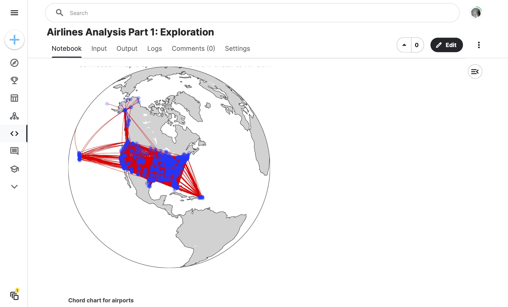

# Airlines Delays Analysis

Python data science project I came up with as a capstone to finish off Jose Portilla's course [Python for Data Science and Machine Learning Bootcamp](https://www.udemy.com/course/python-for-data-science-and-machine-learning-bootcamp/) on Udemy. This is a portfolio project to showcase what I learned from the course.



## Project Details

- [Details](#details)
- [Link to Demo](#link-to-demo)
- [Tools Used](#tools-used)
- [What I learned](#what-i-learned)

## Details

This is a five part analysis and series of machine learning models that dig into the [Airlines Delays](https://www.kaggle.com/datasets/ulrikthygepedersen/airlines-delay) dataset from Kaggle. Loads data in, cleans as necessary for NaN or null values, and has a focused scope for each notebook.

## Link to Demo

Links to each part of the analysis:

- [Part 1: Exploration](https://www.kaggle.com/code/garrettbecker/airlines-analysis-part-1-exploration/notebook)
- [Part 2: Linear and Logistic Machine Learning](https://www.kaggle.com/code/garrettbecker/airlines-analysis-part-2-linear-logistic-ml)
- [Part 3: Decision Trees and Random Forests Machine Learning](https://www.kaggle.com/code/garrettbecker/airlines-analysis-part-3-dt-rf-ml)
- [Part 4: K-Nearest Neighbors and K-Means Clustering Machine Learning](https://www.kaggle.com/code/garrettbecker/airlines-analysis-part-4-knn-k-means-ml)
- [Part 5: Principal Component Analysis](https://www.kaggle.com/code/garrettbecker/airlines-analysis-part-5-pca-ml)

## Tools Used

- Python
- Excel
- numpy
- pandas
- plotly
- matplotlib
- seaborn
- sklearn
- gcmap
- holoviews

## What I learned

Below are some code snippets I'm proud of from this project:

Part 1: Exploration.
Global map of flights in the data.

```python
fig = go.Figure()

## Loop thorugh each flight entry to add line between source and destination
for slat,dlat, slon, dlon, num_flights in source_to_dest:
    fig.add_trace(go.Scattergeo(
                        lat = [slat,dlat],
                        lon = [slon, dlon],
                        mode = 'lines',
                        line = dict(width = num_flights/100, color="red")
                        ))


## Loop thorugh each flight entry to plot source and destination as points.
fig.add_trace(
    go.Scattergeo(
                lon = routes["long_from"].values.tolist() + routes["long_to"].values.tolist(),
                lat = routes["lat_from"].values.tolist() + routes["lat_to"].values.tolist(),
                hoverinfo = 'text',
                text = scatter_hover_data,
                mode = 'markers',
                marker = dict(size = 10, color = 'blue', opacity=0.1,))
    )

## Update graph layout to improve graph styling.
fig.update_layout(title_text="Connection Map Depicting Flights from Brazil to All Other Countries (Orthographic Projection)",
                  height=500, width=500,
                  margin={"t":0,"b":0,"l":0, "r":0, "pad":0},
                  showlegend=False,
                  geo= dict(projection_type = 'orthographic', showland = True, landcolor = 'lightgrey', countrycolor = 'grey'))

fig.show()
```

Part 2: Linear and Logistic Machine Learning.
Linear regression model evaluation.

```python
print('MAE:', metrics.mean_absolute_error(y_test, predictions))
print('MSE:', metrics.mean_squared_error(y_test, predictions))
print('RMSE:', np.sqrt(metrics.mean_squared_error(y_test, predictions)))
```

Part 3: Decision Trees and Random Forests Machine Learning.
Classification report for Decision Trees model.

```python
predictions = dtree.predict(x_test)

print(classification_report(y_test, predictions))
```

Part 4: K-Nearest Neighbors and K-Means Clustering Machine Learning
Plotting the error rate vs tested K values.

```python
plt.figure(figsize=(12,6))
plt.plot(range(1,41), error_rate, linestyle='--', marker='o', markerfacecolor='red', markersize=10)
plt.title('Error Rate vs K Value')
plt.xlabel('K')
plt.ylabel('Error Rate')
```

Part 5: Principal Component Analysis
Plotting the different components found.

```python
plt.figure(figsize=(8,6))
plt.scatter(x_pca[:,0], x_pca[:,1], c=df['Class'], cmap='plasma')
plt.xlabel('First principal component')
plt.ylabel('Second Principal Component')
```
