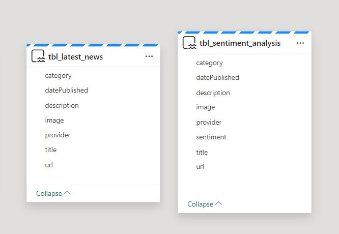
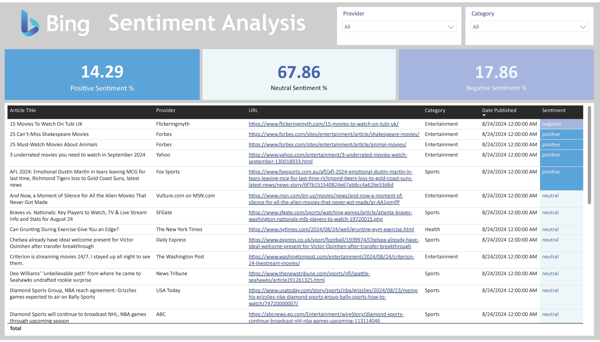
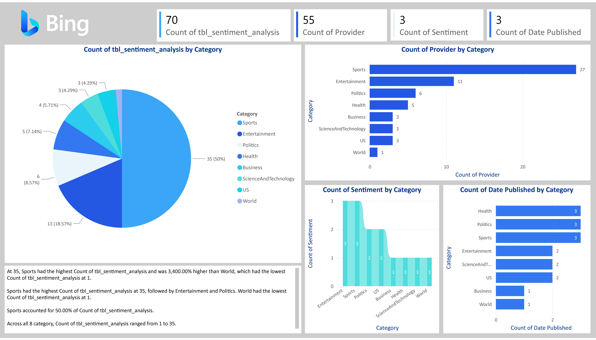
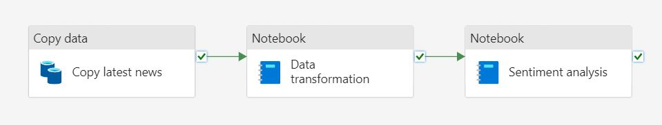
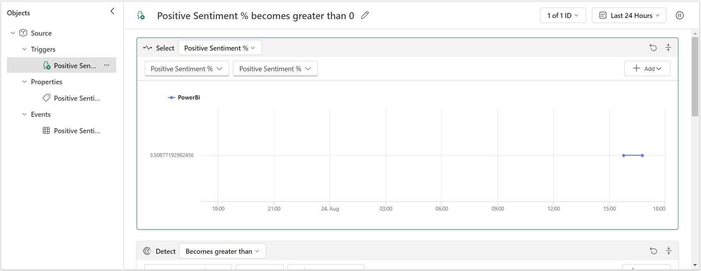
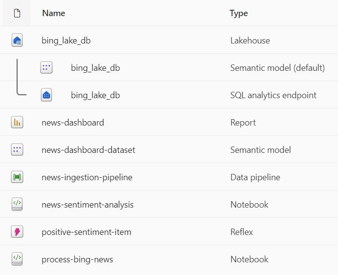

# Bing News Analysis Project

As part of preparing and learning for Microsoft's DP-600 certification, Fabric Analytics Engineer Associate, I knew I wanted to get practical project experience. I am really happy to have found this complete end-to-end project course on Udemy. Mr. K walks you through a complete data and analytics engineering project from start to finish, constructing a sustainable pipeline from data source to report, and even adds in alerts at the end with overall testing procedures. I wanted to highlight this starter project and other personal Fabric work to showcase what I'm learning and exciting capabilities of analytics engineering.

### [Live Demo](https://app.fabric.microsoft.com/view?r=eyJrIjoiOGRmMGFiNDYtOThmNS00YmZkLTk3OTYtMWJiMzAzYjdhOWQ5IiwidCI6ImY3N2E4MGM5LTY5MTAtNGJkYy1iNjFiLTgxNzA2NmQ1NmI0NiIsImMiOjJ9)

## Project Details
- [Bing News Analysis Project](#bing-news-analysis-project)
    - [Live Demo](#live-demo)
  - [Project Details](#project-details)
  - [Details](#details)
  - [By the Numbers](#by-the-numbers)
  - [Tools Used](#tools-used)
  - [Data Engineering Pipeline](#data-engineering-pipeline)
  - [Data Model](#data-model)
  - [Useful Resources](#useful-resources)
  - [Udemy Course Details](#udemy-course-details)
    - [Certificate](#certificate)
    - [Course Details](#course-details)
      - [What you'll learn](#what-youll-learn)
      - [Requirements](#requirements)
      - [Description](#description)
      - [Pre-requisites](#pre-requisites)
      - [Who this course is for:](#who-this-course-is-for)

## Details

This was a great project to complete as someone starting out with Fabric and figuring out how to build a sustainable analytics solution; for this case that was constructing a workflow for Bing News Search analytics.

Starting out, I created a new Bing News Search resource in Azure after signing up for a free account. The resource provided authorization keys which were needed to insert into the headers of the API request. In Fabric, I created a new workspace called "Bing News Analytics Project" to contain all the items that I'd need to manage throughout, and started with a new Data Factory Pipeline called "news-ingestion-pipeline". Adding a "copy data" activity allows to establish which data source you'd like to connect and any configuration options, so for this case that was the "REST" source option. Here, I could add the endpoint for the Bing News Search API, add in authorization key headers from Azure, any query parameters to narrow down the results (like US-based articles and limiting to 100) and be able to test the connection to make sure the data was being pulled correctly. All the results were contained in a single .json file which was saved to a new Lakehouse called "bing_lake_db".

*Initial data pipeline with the copy activity*

*Lakehouse .json data preview*

A new notebook was created called "process-bing-news" which was the central point for data transformation. PySpark was used to pull in the .json file, run multiple commands to extract the data including the "explode" method, and compile all the crucial article information into a single dataframe. An if-statement was used to make sure only articles were selected if there were categories and thumbnail images present for the article. Incremental loading was established at the end of the notebook to add only new articles to the delta table back in bing_lake_db only if the table already exists. A try/catch block was used for the main logic here.

*Process Bing News notebook*

Another new notebook was made called "news-sentiment-analysis", and here is where Synapse ML was used. A pre-trained model was imported for sentiment analysis, and using PySpark, the delta table from the lakehouse was loaded in and assigned sentiment labels based on this model. Incremental loading was also established here with the same logic as in the previous notebook for new articles, and to load back into a lakehouse table.

*News Sentiment Analysis notebook*

*New Lakehouse view with both delta tables*

*Semantic model after loading into the Lakehouse*

Next up was creating a Power BI report with the cleaned and analyzed Bing data. I started out by aut-generating a report from the core semantic model called "news-dashboard" that included the cleaned delta table with sentiment labels from the notebook machine learning model. Another report page was developed that included measures added to the semantic model (percentages for how many articles are positive, neutral, or negative sentiments) and a table with key data fields. The auto-generated report page was redesigned as well as the custom page with a Bing .json theme I made to match the feel for the product.

*Custom report page*

*Auto-generated report page*

Once the report pages were designed and built, one of the final steps for the project was to complete the Data Factory pipeline. Going back to "news-ingestion-pipeline", two more activities were added upon completion of the previous steps: both of them notebook steps. One was for the first notebook called "process-bing-news" and the second for "news-sentiment-analysis". A parameter was created for the first "Copy data" activity to allow flexibility for which search term to use when using the GET request for the Bing API.

*Completed Data Factory pipeline*

The final step was to add a trigger with Data Activator from the custom Power BI report page. I established an alert for the measure calculating the percentage of positive articles by clicking on the card visual, and then selecting "Set alert". A Reflex item was created in another pane that allows you to configure the trigger settings for the visual and where to send the alert notification, whether that's through email or a Teams message. For this one, I chose Teams message and then selected the Reflex item back in the workspace to view the details. A time series trend up top shows when triggers happened, and many other configuration and monitoring tools are here, including who to send notifications to.

*Data Activator trigger for when the percentage of positive articles is greater than 0*

An end-to-end test was conducted to make sure the entire analytics solution performed as expected, from running the pipeline with a new search term in the parameter (such as "sports" or "movies") and checking out Reflex Data Activator and sending a test alert. This was an awesome project to become more comfortable with Fabric and build an analytics project from scratch!

*Workspace items for this project*

Files included for view in this project:
- [`Bing News Analysis Project.pdf`](./news-dashboard.pdf): Result analysis dashboard, showcasing latest articles and sentiment labels
- [`process-bing-news.ipynb`](./Source%20Files/process-bing-news.ipynb): PySpark notebook for processing the .json news data from the API
- [`news-sentiment-analysis.ipynb`](./Source%20Files/news-sentiment-analysis.ipynb): PySpark notebook for using an Azure Synapse sentiment machine learning model
- [`news-ingestion-pipeline.json`](./Source%20Files/news-ingestion-pipeline.json): Source code for the main pipeline

## By the Numbers

- < 1 month of development time
- 1 colleagues collaborated with
- 1 report page
- 1 data source
- 1 query connected to data source

## Tools Used

- Azure
  - Bing News Search API (data source)
  - Synapse Machine Learning
- Fabric 
  - Lakehouse
  - Notebook (PySpark and T-SQL)
  - Data Factory pipeline
  - Data Activator
- Power BI
  - DAX
  - Power Query

## Data Engineering Pipeline

## Data Model

## Useful Resources

- [Microsoft Bing News Search API](https://learn.microsoft.com/en-us/bing/search-apis/bing-news-search/reference/query-parameters)

## Udemy Course Details

Mr. K Talk Tech's [Microsoft Fabric: End to End Data Engineering Project course on Udemy](https://www.udemy.com/course/microsoft-fabric-end-to-end-data-engineering-project).

### [Certificate](https://www.udemy.com/certificate/UC-c20c6dfd-9a82-403f-a807-34634becab8e/)

### Course Details

#### What you'll learn
- You will learn to use Microsoft Fabric for building a Bing News Data Analytics platform, enabling seamless integration with Azure Data Engineering components
- You will learn the process of ingesting data from external sources, specifically utilizing Bing API, using Data Factory.
- You will learn to perform data transformation techniques to shape and refine raw JSON data into curated Delta Tables using Synapse Data Engineering component
- You will learn how to perform sentiment analysis using Synapse Data Science component
- You will learn how to orchestrate data workflows with Data Factory pipelines.
- You will learn how to perform Incremental Load using spark notebooks.
- You will learn how to visualize data effectively using Power BI.
- You will learn how to configure alerts within Power BI visuals with Data Activator.

#### Requirements
- Basic Programming Skills
- Watch the two Pre-requisite videos

#### Description
In this project,  we will build a Bing News Data Analytics platform!

This would be a complete end to end Azure Data Engineering project that's done using Microsoft Fabric. We'll pull raw data from Bing API, transform the raw data to clean data with Synapse Data Engineering, analyze sentiment with Synapse Data Science, set up workflows with Data Factory, make cool reports with Power BI, set alerts with Data Activator, and test everything well. Let's get started on Bing News Analytics! 

The Topics covered in this Project are,

1. Data Ingestion from Bing API using Data Factory: Learn how to seamlessly pull in data from external sources, setting the foundation for your analytics project.
2. Data Transformation using Synapse Data Engineering: Dive into the process of shaping and refining your raw JSON data to a curated Delta Table, including techniques like incremental loading to keep your processes efficient.
3. Sentiment Analysis using Synapse Data Science: Uncover insights hidden within the news description by predicting the sentiment of the news classified as Positive, Negative or Neutral.
4. Orchestration using Data Factory via pipelines: Discover the art of orchestrating your data workflows, ensuring smooth and efficient operations.
5. Data Reporting using Power BI: Visualize your data in a compelling and actionable manner, empowering stakeholders with valuable insights.
6. Configuring Alerts using the Data Activator: Stay ahead of potential issues by setting up alerts and notifications within your Power BI visuals using a new tool called Data Activator.
7. End to End Pipeline Testing: The complete flow will be tested right from the data ingestion to the data transformation and until the report gets updated with the incoming new data to Validate the integrity and performance of your pipelines, ensuring reliability and accuracy.

This project revolves around Bing News Data Analytics, a practical application that involves ingesting news data daily and generating insightful reports. By walking through each step in a simplified manner, I aim to make Azure Data Engineering accessible to all enthusiasts, regardless of their background.

#### Pre-requisites

You don't need to have any skills to do this project. Even if you are an absolute beginner, if you follow the entire course, you will be able to implement this project, The only pre-requisite for this project is, you need to two introductory videos of Microsoft Fabric which is included as part of this course in the section 1.

All the very best and Happy Learning!!!

#### Who this course is for:
- Are new to Azure Data Engineering and want to learn from scratch.
- Data enthusiasts looking to gain practical experience in Azure Data Engineering.
- Professionals seeking to expand their skills in data ingestion, transformation, and analysis.
- Individuals interested in building data analytics platforms using Azure services.