# Joshua Project Analytics

As part of continuing to hone in my data and analytics engineering skills, as well as become more familiar and skilled in Fabric, I thought of other topics I'm passionate about and came across Joshua Project's public API. They are an organization keeping track and reporting on where Christians are around the world, specifically focusing on countries that have not heard the gospel or have Bible translations. Their data source is rich with tons of valuable of information, and it was difficult narrowing in on what to show for the resulting reports! Working on a plausible analytics engineering solution for Joshua Project was a lot of fun and super valuable to continue learning and growing, as well as share a topic I'm passionate about. 

### [Live Demo](https://app.fabric.microsoft.com/view?r=eyJrIjoiMmFkNzFmNDUtYzI4Yi00NmM5LWJiMzMtNjhhMDM1ODNkNDM5IiwidCI6ImY3N2E4MGM5LTY5MTAtNGJkYy1iNjFiLTgxNzA2NmQ1NmI0NiIsImMiOjJ9)

## Project Details
- [Joshua Project Analytics](#joshua-project-analytics)
    - [Live Demo](#live-demo)
  - [Project Details](#project-details)
  - [Details](#details)
  - [By the Numbers](#by-the-numbers)
  - [Tools Used](#tools-used)
  - [Data Engineering Pipeline](#data-engineering-pipeline)
  - [Data Model](#data-model)
  - [Useful Resources](#useful-resources)

## Details

This was a great project to complete as someone starting out with Fabric and figuring out how to build a sustainable analytics solution; for this case that was constructing a workflow for Joshua Project.

Before diving in and making Fabric resources, I scoped out Joshua Project's API to learn more. They have a great developer team over there and have laid out in detail everything you need to know to get started - from sample code snippets in different languages to examples of responses to column by column descriptions for each major entity. There are just a few key components available to pull from, and I decided to use the main ones available to build the model later: countries, languages, and people groups. There was also an additional call for a "daily unreached" people group which randomly selects an unreached group everyday, and I decided to pull this in as well to have available on the overview dashboard page. This page was my source of truth for navigating all the mysterious column names and how the entities best fit together.

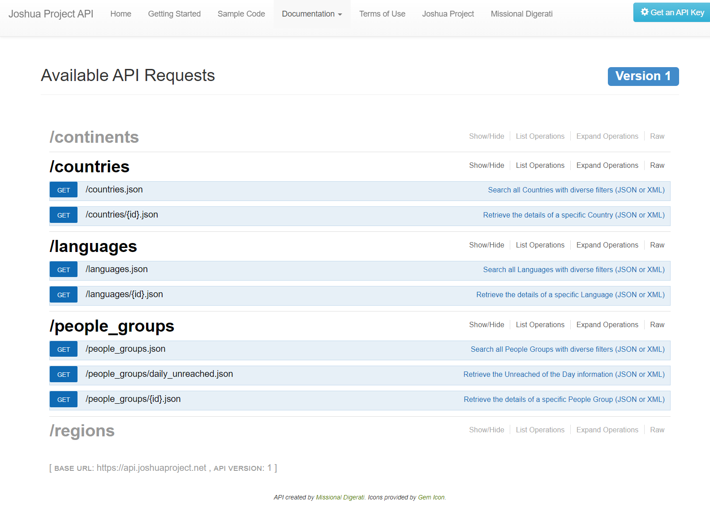
*Joshua Project's API Documentation Page*

Once I had my plan of which entities to pull in and their corresponding API calls, I went back to Fabric and started out with a lakehouse called "JoshuaProject_Lakehouse". Getting this central repository for files and tables situation has become my go-to starting point, and I'm really enjoying using this resource as my project's central hub. It's so nice having the SQL endpoint you can flip to with a button. Below is the final view of tables at the culmination of the workflow, and there are a couple of JSON files in the Files folder that were fed in through the dataflows later.

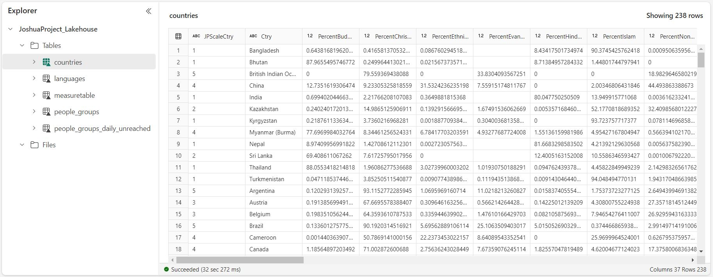
*JoshuaProject_Lakehouse*

Figuring out how the pipeline would work definitely took the longest as expected, and even as I was working on reports I had to come back here and tweak it a little bit. The reason for this was that initially, I had the step for calling the Languages API right after calling the Countries data at the beginning, but I moved this step until after pulling in the main People Groups data. This is why it's important to read API documentation carefully, because I missed that Joshua Project's API results are limited to 250 records at a time, especially for how many languages there are. I was only pulling in languages that started with A! So what I did was modify the pipeline to do a quick query of just the unique language codes from the People Groups data I pulled in, assign those to a pipeline variable, and then clean up/concatenate those language codes to be added to the request URL for Languages, in the "ids" parameter. It's quite nice having the dynamic variables box available to use to make things flexible. This way I was able to call the Languages API just once instead of looping through code by code.

During this phase I also established two dataflows based on M code: one for the main People Groups data and another for the smaller People Groups Daily Unreached data. The pipeline was pulling these in as JSON files so the flows pulled these from Files and transformed them into delta tables for the lakehouse. Reason for this was to add a custom column for Bible Status because the original data from their API only had numbers but I wanted a text label for more meaning when visualizing. I actually had to delete part of the original semantic model I made to accommodate this change; it was strange that new columns didn't get refreshed into the model, but as this was a small change it wasn't bad to implement.

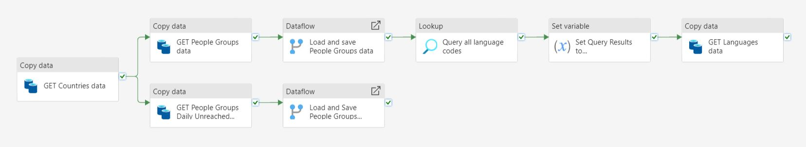
*Completed Data Factory Pipeline*

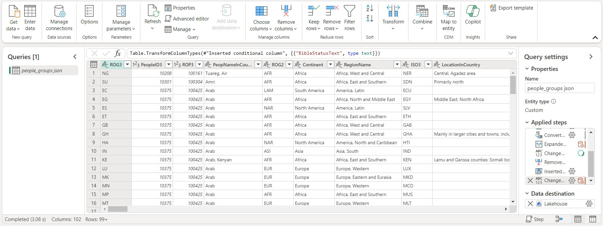
*Dataflow for the main People Groups dataset*

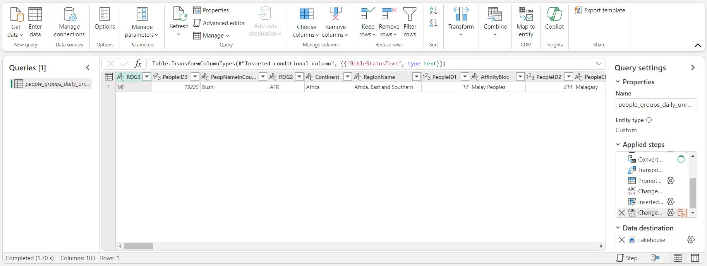
*Dataflow for the smaller People Groups Daily Unreached dataset*

Next up was creating the semantic model. As mentioned previously I had an original version without my new "BibleStatusText" column which was not getting updated with the column after I modified the dataflows. This could be a kink in the early version of Fabric that Microsoft's working out. Joshua Project's API documentation helped me use the best columns for establishing relationships, and I chose bi-directional filtering where I wanted to allow flexibility in reports later on. I also used a PySpark notebook to add a measure table to the model in case I added any custom calculations.

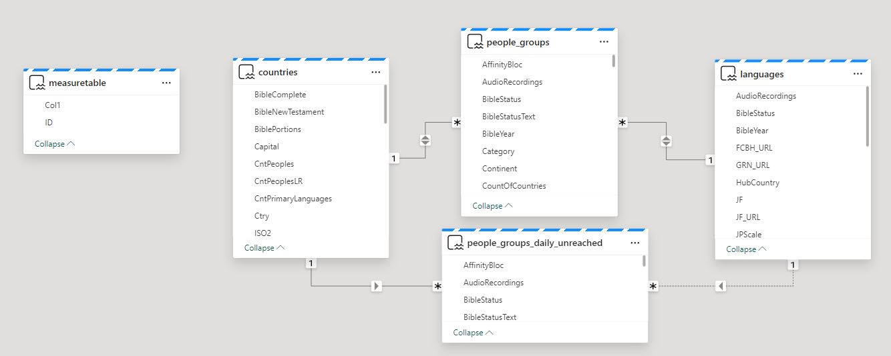
*Semantic model overview*

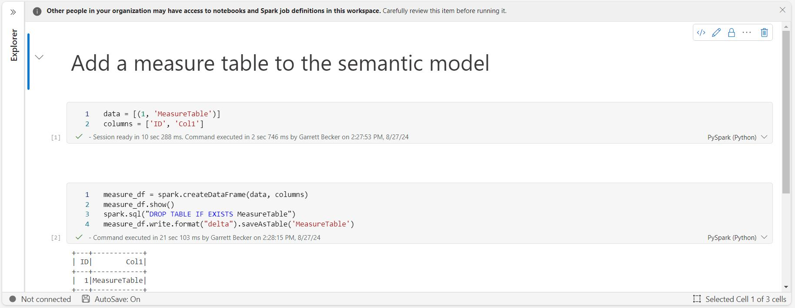
*PySpark notebook for adding a measure table to the model*

With the model set, now I could get into the fun part and play around with the data. This was very hard narrowing down on what to show here because there was so much good stuff! But I also know from experience that it's way better to have self-control and not try to do too much because you want to help tell a good story and assist others to discover new information and unlock insights they don't expect. I settled on an overview page with a couple of visuals for the spotlight on an unreached people group, a few cards to give high level stats, and quick charts to give a lay of the land. The next few pages go into detail on each of the main data entities (with connections between them as needed when filtering) starting with People Groups, then Countries and finally Languages. I thought it would be great to give more information about how things are going with specific people groups and developing Bible translations, as well as dig more into countries and languages as a whole. I imagined what kind of views might be most valuable not just at Joshua Project but any church or organization interested in analyzing this information.

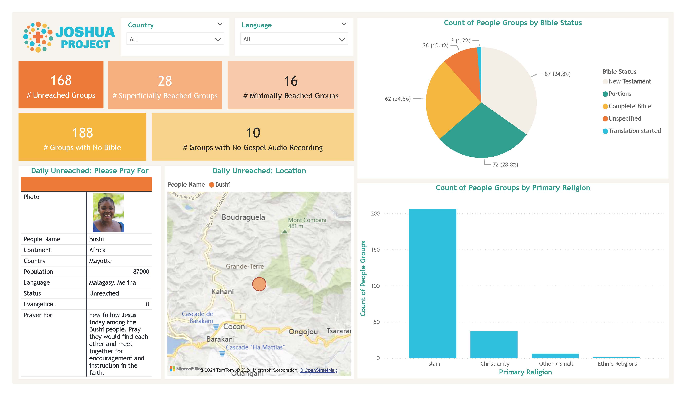
*"Overview" report page*

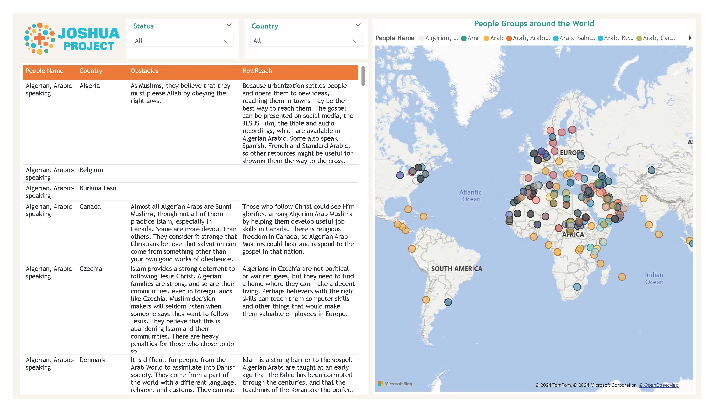
*"People Groups Detail" report page*

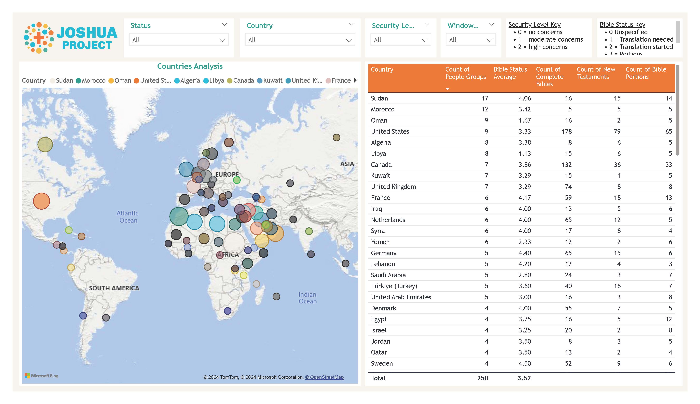
*"Countries" report page*

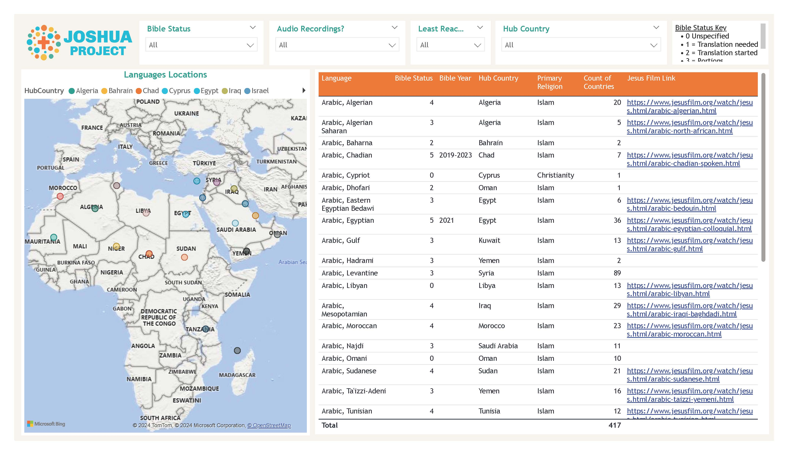
*"Languages Analysis" report page*

The last stop was to add an alert to make use of Data Activator. For this workflow I thought it would be fun to add one based on the "Countries Analysis" page when the average of the Bible Status value is greater than 4; which means that most of the people groups within that country have at least a New Testament translation (see key at the report page top) and that's cause for celebration! The alert sends a Teams message currently but the method can be changed to an Outlook email.

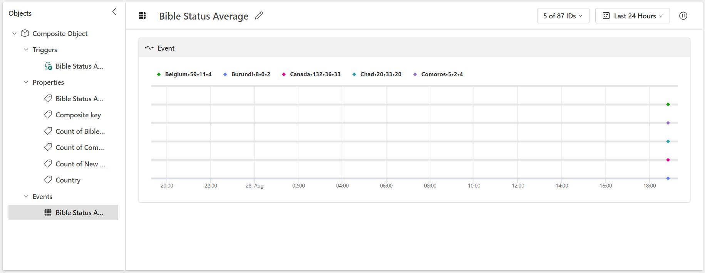
*Data Activator view for trigger: Bible Status average is greater than 4*

I have scheduled the pipeline to run once a week in the morning, and it's working perfectly so far. Below are all the items in the workspace I used for this project. I greatly enjoyed working on this project and thought it was an awesome way to celebrate what God is doing all around the world and to track Bible translations!

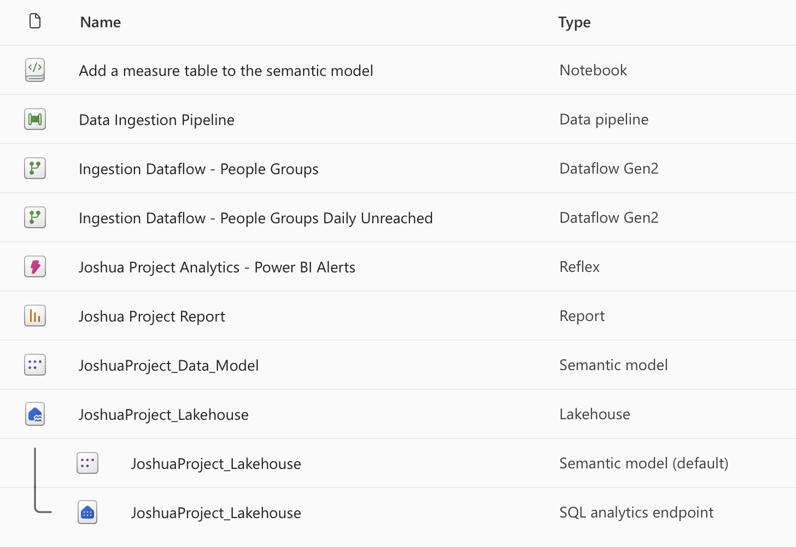
*Workspace items for this project*

Files included for view in this project:
- **Joshua Project Report.pdf**: Result analysis dashboard
- **Add a measure table to the semantic model.ipynb**: PySpark notebook for adding a measure table to the semantic model
- **Data Ingestion Pipeline.json**: Underlying source code for the developed Data Factory pipeline
- **Ingestion Dataflow - People Groups.json**: Code behind the Dataflow for processing People Groups data
- **Ingestion Dataflow - People Groups Daily Unreached.json**: Code behind the Dataflow for processing People Groups Daily Unreached data

## By the Numbers

- < 1 month of development time
- 0 colleagues collaborated with
- 4 report pages
- 1 data source
- 4 queries connected to data source

## Tools Used

- Fabric 
  - Lakehouse
  - Data Factory pipeline
  - Dataflow Gen2
  - Data Activator
- Power BI
  - DAX
  - Power Query

## Data Engineering Pipeline

## Data Model

## Useful Resources

- [Joshua Project API Documentation](https://api.joshuaproject.net/)