# LEGO Rebrickable Analytics

  
   

I was really excited to dig into this personal project and fine-tune my analytics engineering skills because Rebrickable has public LEGO data available, and LEGO has always been one of my favorite hobbies ever. They inspire creativity and imagination, remain high quality with the system they developed throughout the years, and I always loved the different themes and storyline to get lost in as a child. It's encouraging for me that many more people are discovering LEGO for themselves and building models from sets or on their own with the parts they have. I've used Rebrickable quite a bit to discover other creators' custom MOCs (my own creations) and love that they have these publicly available datasets across many different entities, such as colors, themes, sets, and categories. I wanted to have fun with this one and practice my analytics skills with a scalable end-to-end solution for LEGO Rebrickable data.

### [Live Demo](https://app.fabric.microsoft.com/view?r=eyJrIjoiMGZjMjEyNTItZjA1ZS00NDYwLTljYTgtYTg1Mzg0NDM0OTRhIiwidCI6ImY3N2E4MGM5LTY5MTAtNGJkYy1iNjFiLTgxNzA2NmQ1NmI0NiIsImMiOjJ9)

## Project Details
- [LEGO Rebrickable Analytics](#lego-rebrickable-analytics)
    - [Live Demo](#live-demo)
  - [Project Details](#project-details)
  - [Details](#details)
  - [By the Numbers](#by-the-numbers)
  - [Tools Used](#tools-used)
  - [Data Engineering Pipeline](#data-engineering-pipeline)
  - [Data Model](#data-model)
  - [Useful Resources](#useful-resources)

## Details

This was a great project to complete as someone starting out with Fabric and figuring out how to build a sustainable analytics solution; for this case that was constructing a workflow for Rebrickable's LEGO datasets.

I checked out Rebrickable's public datasets and their documentation before making any Fabric resources; I've learned this is great practice to understand what you're working with, how to access information, and anything you need to make your life easier down the road. Rebrickable is a third-party platform that has collected LEGO data over the years, but is not a direct source of LEGO data itself, and they have two options for data pulls. One is through their API which contains the datasets of interest for this project along with manaing Rebrickable user information via REST calls. The other is from .gz compressed .csv files that can be downloaded directly from the links on the designated page. I acquired an API key and tested the calls with the Data Factory pipeline back over in Fabric which worked as expected; however for what I was wanting to do - which was analyze all of the data available Rebrickable had to offer - it wasn't possible to mass download all the information from API calls easily. In their documentation they make a note of this as well and point to the compressed .csv files as the place to go to get everything. Below is the schema Rebrickable provided for all the entities of LEGO data they have.

*Rebrickable's data schema*

I've worked on a couple of personal Fabric projects up to this point and thought this was a great opportunity for a new challenge: how about I use the pipeline to pull the data from these csv.gz download links instead of using the API? That way I could have all the information I wanted to play with. Rebrickable has publicly accessible CDN links from their cloud source for each dataset, and so it was simple using an HTTP connection in Data Factory to access these files and decompress them. The only tricky part however was that the datasets update daily which is great, but the numbers in the relative URLs change each day; I still wanted to see if I could set up the pipeline to run daily and download a fresh copy of data every morning dynamically without my checking what the new URL string was. I was able to solve this by adding in a PySpark notebook at the start of the pipeline to web scrape the page and pull these relative URLs, consolidate them into a single, delimited string as a notebook export, which was then split apart as variables back over in the pipeline. This was awesome practice with more Python and being able to dynamically pull these csv datasets!

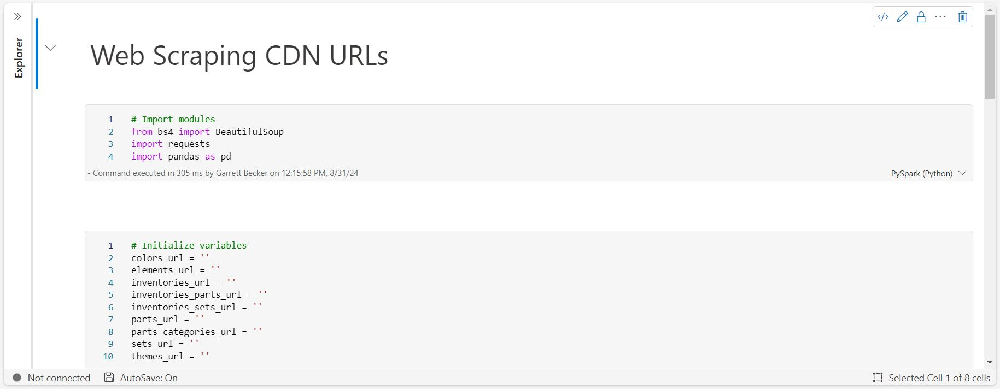
*PySpark notebook for web scraping Rebrickable's CND download links*

From there I was able to construct more of the Data Factory pipeline, first by using Copy activities to pull each of the 9 entities I was interested in for building the final data model (which used the variable I exported from the notebook to dynamically change each day there was a refresh) and then make two Power Query dataflows. These dataflows connected to the raw decompressed .csv files which were saved in the lakehouse. To practice my analytics engineering skills, I decided to first make a dataflow that pulls in each source as is and designate them as staging tables in the lakehouse with the prefix "staging_", and then the second dataflow would focus on the final model tables, using the prefix "obt_" aka "one big table". All of the data was very clean and I didn't see the need for intermediary tables between these two layers. This way when the Lakehouse was in view, it was quick and easy to spot the raw data from the source, and the final model tables after transformation and cleaning.

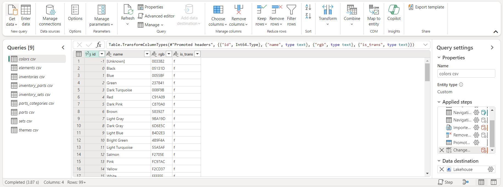
*Staging dataflow*

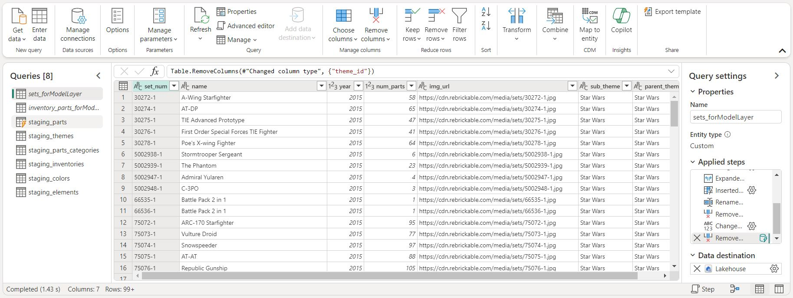
*Modeling dataflow*

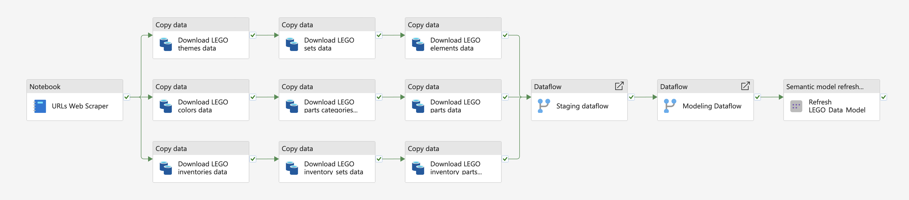
*Data Factory pipeline overview*

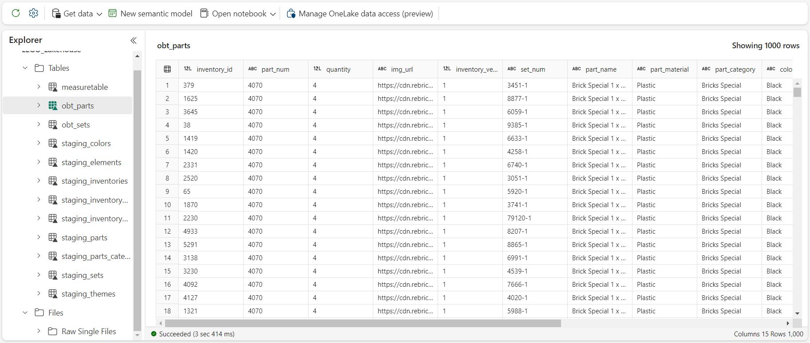
*LEGO_Lakehouse overview after pulling data and both dataflows*

From `LEGO_Lakehouse` I was able to instantiate a new semantic model with specific tables from the main dbo schema, and this is where I selected both "obt" tables I made: `obt_sets` and `obt_parts`. I designed the tables so the main connection point was between the `set_num` column in both, and these would be connected on a many-to-many relationship. Filtering works in both directions to provide flexibility in reporting later. The other part I wanted to include was a measure table for organization, so similar to other Fabric projects I've worked on, I included a quick PySpark notebook to add a measure table to this new semantic model.

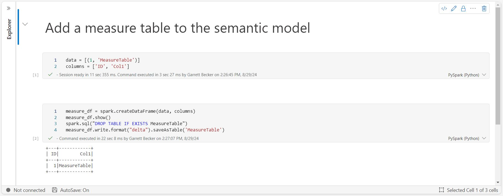
*PySpark notebook for adding a measure table to the semantic model*

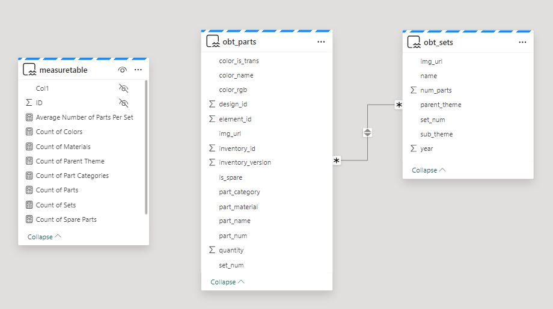
*LEGO_Data_Model overview*

Next up was creating the Power BI reports, and I was definitely looking forward to this! There was so much rich information in these datasets that it made for a difficult time figuring out what to focus on; this is a good problem to have. I settled on three analysis pages: one for sets, another for parts, and a third for themes. Trends are used across all three pages because I wanted to include the year timestamps included to give more understanding how LEGO has grown and changed over the years. It was also fascinating seeing how certain themes included certain colors and part materials, how the number of sets and parts correlated with one another, and even digging a bit into spare parts (I've always enjoyed having extras at the end of building). I connected these report pages directly to the semantic model I established earlier, writing measures in Fabric as well, so that the analyst would focus more on reporting and less on the data structures themselves.

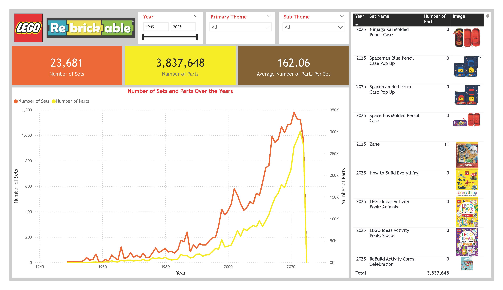
*Sets Analysis Report Page*

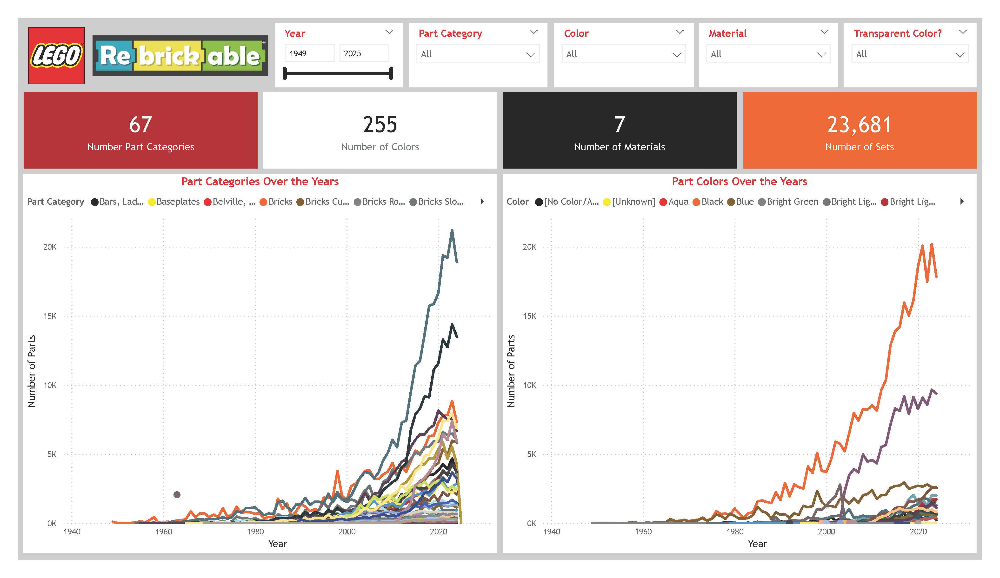
*Parts Analysis Report Page*

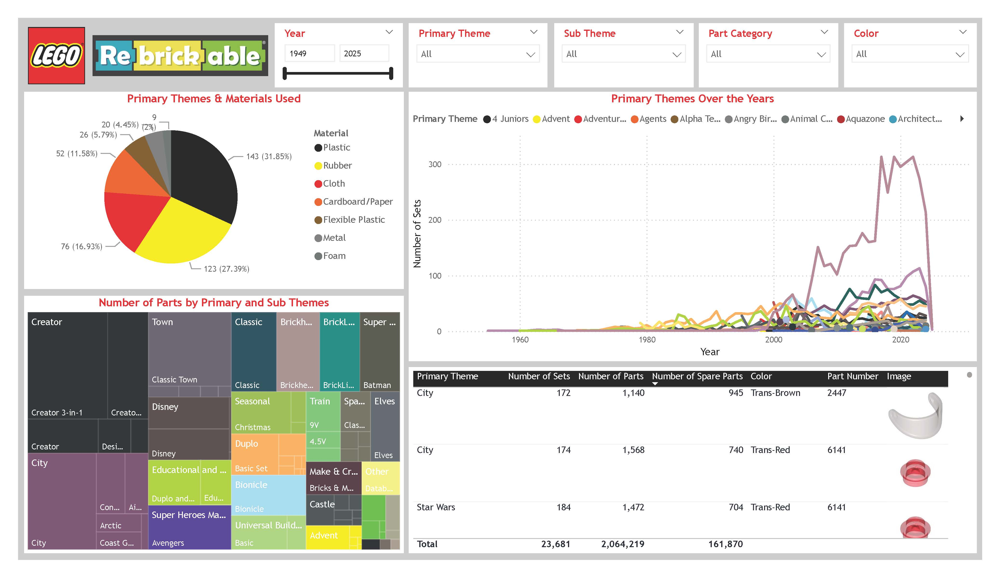
*Themes Analysis Report Page*

The last feature to add was an alert to make use of Data Activator. As I was checking out the spare parts detail in the reports, I noticed that there were a few themes that crossed over 1,000 unique parts being included as a spare in a single year. I'm not familiar if LEGO keeps track of these, but it might be worth checking into if this count gets exceedingly high - so I included an alert to send a Teams message if this occurs. This method can be changed to an Outlook email.

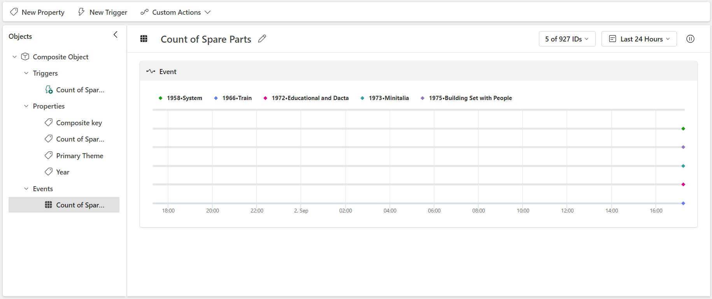
*Data Activator view for trigger: when number of spare parts for a theme in a year is greater than 1,000*

I have scheduled the pipeline to run everyday in the morning, and it's working perfectly so far. Below are all the items in the workspace I used for this project. I greatly enjoyed working on this project and loved creating an analytics solution for one of the things I love best: LEGO building!

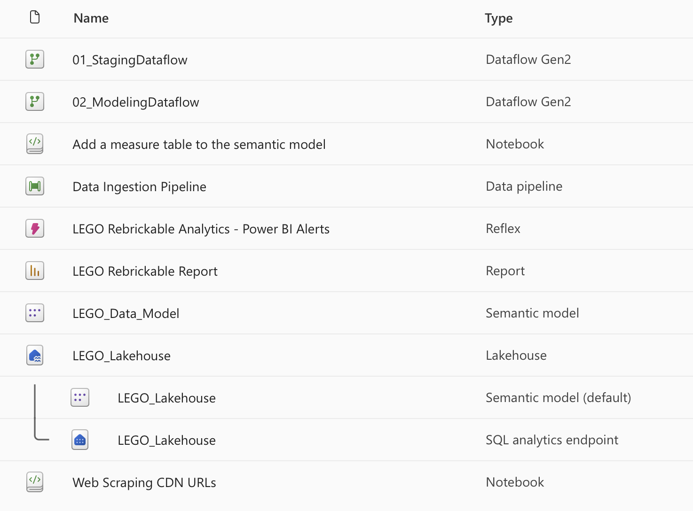
*Workspace items for this project*

Files included for view in this project:
- [`LEGO Rebrickable Report.pdf`](./LEGO%20Rebrickable%20Report.pdf): Result analysis dashboard
- [`01_StagingDataflow.json`](./Source%20Files/01_StagingDataflow.json): First dataflow for creating staging tables
- [`02_ModelingDataflow.json`](./Source%20Files/02_ModelingDataflow.json): Second dataflow for creating model tables
- [`Add a measure table to the semantic model.ipynb`](./Source%20Files/Add%20a%20measure%20table%20to%20the%20semantic%20model.ipynb): PySpark notebook for adding a measure table to the semantic model
- [`Web Scraping CDN URLs.ipynb`](./Source%20Files/Web%20Scraping%20CDN%20URLs.ipynb): PySpark notebook for web scraping Rebrickable's CND download links
- [`Data-Ingestion-Pipeline.json`](./Source%20Files/Data-Ingestion-Pipeline.json): Source code for the main Data Factory pipeline

## By the Numbers

- < 1 month of development time
- 0 colleagues collaborated with
- 2 report pages
- 1 data source (Rebrickable CDN)
- 9 queries connected to data sources

## Tools Used

- Fabric 
  - Lakehouse
  - Data Factory pipeline
  - Dataflow Gen2
  - PySpark Notebooks
  - Data Activator
  - Semantic model
- Power BI
  - DAX
  - Power Query

## Data Engineering Pipeline

## Data Model

## Useful Resources

- [Rebrickable API Documentation](https://rebrickable.com/api/v3/docs/?key=)
- [Rebrickable Downloads Page](https://rebrickable.com/downloads/)