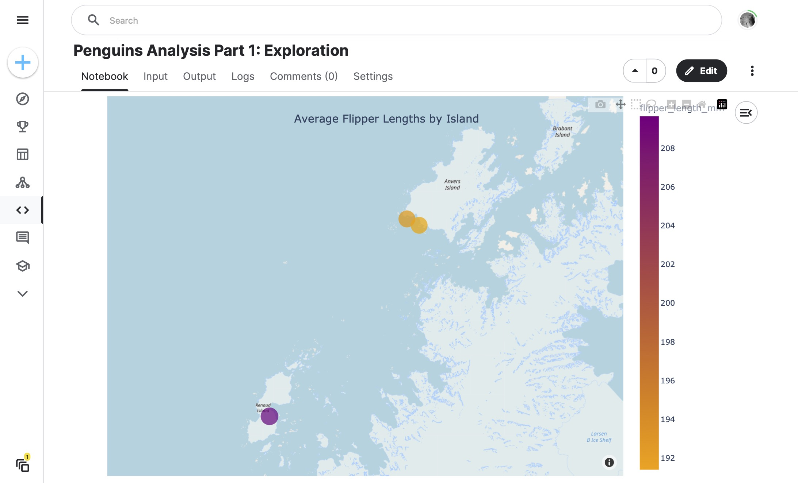

# Penguins Analysis

Python data science project I came up with as a capstone to finish off Jose Portilla's course [Python for Data Science and Machine Learning Bootcamp](https://www.udemy.com/course/python-for-data-science-and-machine-learning-bootcamp/) on Udemy. This is a portfolio project to showcase what I learned from the course.



## Project Details
- [Details](#details)
- [Link to Demo](#link-to-demo)
- [Tools Used](#tools-used)
- [What I learned](#what-i-learned)

## Details

This is a five part analysis and series of machine learning models that dig into the [Penguins](https://www.kaggle.com/datasets/larsen0966/penguins) dataset from Kaggle. Loads data in, cleans as necessary for NaN or null values, and has a focused scope for each notebook.

## Link to Demo

Links to each part of the analysis:

- [Part 1: Exploration](https://www.kaggle.com/code/garrettbecker/penguins-analysis-part-1-exploration)
- [Part 2: Linear and Logistic Machine Learning](https://www.kaggle.com/code/garrettbecker/penguins-analysis-part-2-linear-and-logistic-ml)
- [Part 3: Decision Trees and Random Forests Machine Learning](https://www.kaggle.com/code/garrettbecker/penguins-analysis-part-3-dt-rf-ml)
- [Part 4: K-Nearest Neighbors and K-Means Clustering Machine Learning](https://www.kaggle.com/code/garrettbecker/penguins-analysis-part-4-knn-k-means-ml)
- [Part 5: Principal Component Analysis](https://www.kaggle.com/code/garrettbecker/penguins-analysis-part-5-pca-ml)

## Tools Used

- Python
- Excel
- numpy
- pandas
- plotly
- matplotlib
- seaborn
- sklearn

## What I learned

Below are some code snippets I'm proud of from this project:

Part 1: Exploration.
Map of average bill lengths by island.
```python
color_scale = [(0, 'green'), (1,'yellow')]

fig = px.scatter_mapbox(
    df_island_averages, 
    title='Average Bill Lengths by Island',
    lat='latitude', 
    lon='longitude', 
    hover_name='island', 
    hover_data=['island', 'bill_length_mm'],
    color='bill_length_mm',
    color_continuous_scale=color_scale,
    size='bill_length_mm',
    zoom=6.5, 
    height=600
)

fig.update_layout(
    title_x=0.3,
    title_y=0.95,
    mapbox_style="open-street-map",
    margin={"r":0, "t":0, "l":0, "b":0}
)

fig.show()
```

Part 2: Linear and Logistic Machine Learning.
Plotting how the actuals vs predicted values correlate.
```python
predictions = lm.predict(x_test)

fig, ax = plt.subplots(figsize=(10, 6))

sns.scatterplot(data=None, x=y_test, y=predictions)
```

Part 3: Decision Trees and Random Forests Machine Learning.
Output the classification report.
```python
predictions = rfc.predict(x_test)

print(classification_report(y_test, predictions))
```

Part 4: K-Nearest Neighbors and K-Means Clustering Machine Learning
Plotting the error rate vs tested K values.
```python
plt.figure(figsize=(12,6))
plt.plot(range(1,41), error_rate, linestyle='--', marker='o', markerfacecolor='red', markersize=10)
plt.title('Error Rate vs K Value')
plt.xlabel('K')
plt.ylabel('Error Rate')
```

Part 5: Principal Component Analysis
Plotting the different components found.
```python
plt.figure(figsize=(8,6))
plt.scatter(x_pca[:,0], x_pca[:,1], c=df['body_mass_g'], cmap='plasma')
plt.xlabel('First principal component')
plt.ylabel('Second Principal Component')
```
