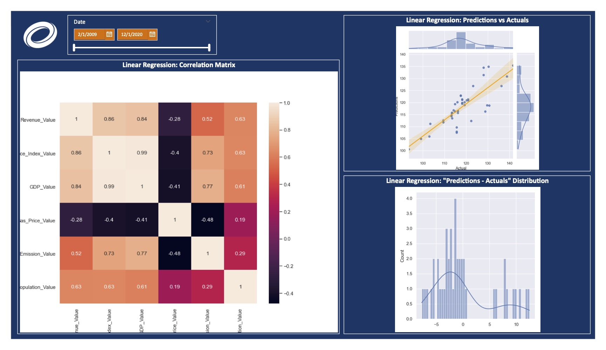

# Power BI + Python + Machine Learning Forecasting

Coming soon!



## Project Details
- [Details](#details)
- [By the Numbers](#by-the-numbers)
- [Tools Used](#tools-used)
- [What I learned](#what-i-learned)
- [Useful resources](#useful-resources)

## Details

Coming soon!

Files included for view in this project:
- Power BI + Python + Machine Learning Forecasting.pdf

## By the Numbers

- 2 months of development time
- 2 colleagues collaborated with
- 3 report pages
- 6 data source
- 6 queries connected to data sources

## Tools Used

- Excel
- Power BI
  - DAX
  - Power Query
- SharePoint (data source)

## What I learned

Below are some code snippets I'm proud of from this project:

DAX formula for custom color formatting
```DAX

```

Using a DAX SWITCH and USERELATIONSHIP to let users control which category to view by
```DAX

```

DAX UNION table to combine fields from multiple tables
```DAX

```

## Useful Resources

- [Power BI: Filter by a measure in a slicer](https://www.youtube.com/watch?v=AZAL-QPn5Zc) - Filtering visuals by DAX measure values is not natively supported in Power BI but this video helped me find a clever solution
- [Power BI: Dynamic axes and legends](https://www.youtube.com/watch?v=8e8a3o1w51M) - Perfect for making visuals with dynamic axes so users can pick what category they want to view by
- [Power BI: Date Tables](https://www.youtube.com/watch?v=WybnTHDl-AM) - Quickly generate date tables to use in your data model