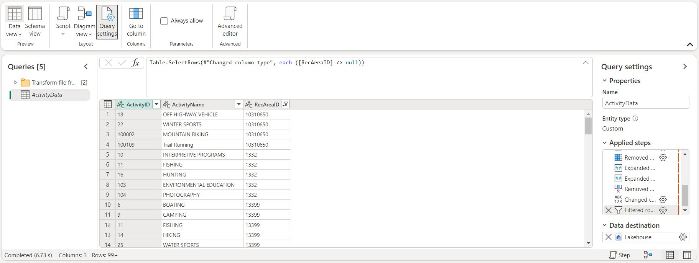

# Recreation.gov Analytics

I wanted to get more hands-on Fabric analytics engineering project work, and thought it would be fun to create solutions for topics I'm passionate about. Nature is one of the best gifts we have, and I'm grateful for all the amazing ways we can get out there and explore, discover new trails and enjoy the world around us. Hiking mountains is one of my favorite things! In 2023 I actually used Recreation.gov to book a ticket for Multnomah Falls in Oregon, not knowing that they actually had a public API I could use with the account I made. For this project I dug into their documentation and explored their data, and built an concept analytics solution that focuses on how someone at the organization could funnel data into a stable and scalable data model, and then build reports they could share either with the public or use internally. 

### [Live Demo](https://app.fabric.microsoft.com/view?r=eyJrIjoiYTY0YWU4MDItNjkyOS00MTIyLThjMTItZWFlMjllYzE0NWJlIiwidCI6ImY3N2E4MGM5LTY5MTAtNGJkYy1iNjFiLTgxNzA2NmQ1NmI0NiIsImMiOjJ9)

## Project Details
- [Recreation.gov Analytics](#recreationgov-analytics)
    - [Live Demo](#live-demo)
  - [Project Details](#project-details)
  - [Details](#details)
  - [By the Numbers](#by-the-numbers)
  - [Tools Used](#tools-used)
  - [Data Engineering Pipeline](#data-engineering-pipeline)
  - [Data Model](#data-model)
  - [Useful Resources](#useful-resources)

## Details

This was a great project to complete as someone mastering Fabric and figuring out how to build a sustainable analytics solution; for this case that was constructing a workflow for Recreation.gov.

To start out, I explored Recreation.gov's API documentation to better understand their schema, various API calls, acquiring a key to authenticate, what information I wanted to use. It was a lot but the more APIs I use, the more I thank myself later when I do the upfront research and recon to figure out what I'm working with. Thankfully Recreation.gov's team did a fantastic job laying out the different calls, categorizing them by entity, and any query parameters you need; plus being able to try out certain endpoint right there on their site saved me a lot of time when tweaking how I incorporated them into Data Factory.

*Recreation.gov's API documentation page*

Back in Fabric, the first resource I made was a lakehouse called "Recreation_Lakehouse" which was intended to be the main hub for any files and delta tables. I'm really enjoying using these lakehouses because of how easy it is to see the raw files and cleaned tables right there, plus having another view for traditional SQL querying is awesome. I'm fast becoming a nerd for these! Below is the overview of how the lakehouse looked after finishing this workflow, with delta tables for core entities plus folders for raw JSON files from API calls.

*Reservation_Lakehouse final view*

Crafting the Data Factory pipeline took the longest, but it was worth the effort tackling the process in phases and ensuring that each component worked before moving onto the next. At first I created REST endpoints for individual entities like RecArea and Facility, grabbing a random sampling of each and then loaded them into the lakehouse. But then I wondered, wait: was there a way to loop through each of the RecAreaIDs I pulled to query any underlying Facilities they had, so that way I could establish clear connections between delta tables in the model? I was convinced there was a way, so I tackled that challenge like I have with other web dev and coding projects I had at work: research and trial/error. 

The Data Factory UI is simple but not always immediately obvious which activity I needed or how to use it correctly, but here is how I got the loop function to work like I wanted. After grabbing all of the data needed from the API, I used a Dataflow to clean up and combine the JSON files if there were multiple, loaded everything into a new delta table in the lakehouse. It was from this table I used a Lookup activity to query the IDs (whether it was for RecArea or Facility), and then fed into a for-loop: assigning a variable I created beforehand and then using that variable in a subsequent API call. The process was repeated again for adding another dataflow to clean up the JSON data and get it ready for the delta table. I have to say, it felt awesome figuring this out and making it stable and scalable! At the end of the day, the result was four delta tables: RecArea, Facility, Activity and Campsite.

*Pipeline final view*

*Dataflow for RecArea data*

*Dataflow for Facility data*

*Dataflow for Activity data*

*Dataflow for Campsite data*

After working through the pipeline iteratively and fixing bugs (such as filtering out NULLs so API calls wouldn't crash), next up was creating the data model and a few mock-up reports. I already did planning beforehand while establishing the dataflows to make sure that primary and foreign keys had the right data types and could be synced up, so thankfully this part went smoothly. Fabric makes it easy to create a new semantic model from lakehouse tables, and I'm getting into the habit of managing anything model related here - so that when it's loaded into Power BI, all users have to do is use the fields and measures in the report. I've been used to doing everything in Power BI before, so this is really nice managing and organizing the model in a separate place and being able to govern it more effectively. I also used a small notebook to create a separate table for measures and added it to the model.

*Data model based on lakehouse delta tables*

*Notebook for adding a measures table*

I approached creating Power BI reports in a couple of different views: What would Recreation.gov users might like to see on a public site? What information would be valuable to internal staff on the data team? The first three reports give an overview of the main data entities (RecArea, Facility, Activity and Campsite) and explore the locations on maps, looks at most available and least available activities to do, and allows users to see where facilities are and their underlying campsites if there are any. The last report makes use of the "LastDateUpdated" field to look at when data modifications were being made, and I thought this would be interesting to view on a time series trend for RecArea and Facility, since these are likely updated most often.

*"Overview" report page*

*"Facility and Campsite Maps" report page*

*"RecArea Activities" report page*

*"Data Maintenance" report page*

The last step I had was to try out Data Activator again, and I thought it would be interesting to show an alert based on the Data Maintenance report. I created a couple of measures for RecArea and Facility, calculating how many days it's been since the last update. I made up a rule of 365 days to suggest that it might be time to update or at least review the data in the system, so this was the threshold I set the alert at for both measures. This view is nice to have to look at how things trend over time.

*Data Activator triggers*

I have scheduled the pipeline to run a few times per week early in the morning, and so far it's working perfectly. Below are all the items in the workspace I used for this project. This was an awesome way to celebrate nature, one of the things I love and enjoy, and build an analytics solution for an organization in this space.

*Workspace items for this project*

Files included for view in this project:
- **Recreation.gov Report.pdf**: Result mock-up reports
- **Data Ingestion Pipeline.json**: Code behind the Data Factory pipeline in Fabric
- **RecArea_Dataflow.m**: Dataflow for RecArea data
- **Facility_Dataflow.m**: Dataflow for Facility data
- **Activity_Dataflow.m**: Dataflow for Activity data
- **Campsite_Dataflow.m**: Dataflow for Campsite data
- **Add a measure table to the semantic model.ipynb**: Notebook for adding a measure table to the semantic model

## By the Numbers

- < 1 month of development time
- 0 colleagues collaborated with
- 4 report pages
- 1 data source
- 4 queries connected to data source

## Tools Used

- Fabric 
  - Lakehouse
  - Data Factory pipeline
  - Dataflow Gen2
  - Data Activator
- Power BI
  - DAX
  - Power Query

## Data Engineering Pipeline

## Data Model

## Useful Resources

- [Recreation.gov API Documentation](https://ridb.recreation.gov/docs)